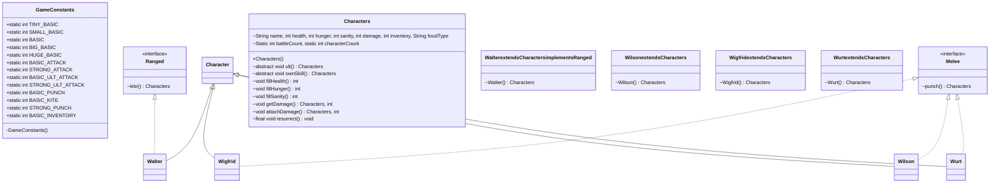

# RunningClassHW
스프링 부트캠프 달리기반 과제

롤은 안해봐서 다른 게임 캐릭터 이름 따왔습니다!

메인함수 Main.java
각 캐릭터 공통 Characters.java
캐릭터 walter, wigfrid, wilson, walter

랜덤한 두 캐릭터가 싸우다가 한쪽이 죽으면 승패 출력

```mermaid
classDiagram
    class GameConstants {
        +static int TINY_BASIC
        +static int SMALL_BASIC
        +static int BASIC
        +static int BIG_BASIC
        +static int HUGE_BASIC
        +static int BASIC_ATTACK
        +static int STRONG_ATTACK
        +static int BASIC_ULT_ATTACK
        +static int STRONG_ULT_ATTACK
        +static int BASIC_PUNCH
        +static int BASIC_KITE
        +static int STRONG_PUNCH
        +static int BASIC_INVENTORY
        
        -GameConstants()
        
        
    }
    class Ranged {
        <<interface>>
        ~kite() Characters
    }
    class Melee {
        <<interface>>
        ~punch() Characters
    }
    class Characters {
        ~String name, int health, int hunger, int sanity, int damage, int inventory, String foodType
        ~Static int battleCount, static int characterCount
        +Characters() 
        
        ~abstract void ult() Characters
        ~abstract void ownSkill() Characters
        ~void fillHealth() int
        ~void fillHunger() int
        ~void fillSanity() int
        ~void getDamage() Characters, int
        ~void attachDamage() Characters, int
        ~final void resurrect() void
    }
    class Walter extends Characters implements Ranged{
        ~Walter() Characters
    }
    class Wilson extends Characters {
        ~Wilson() Characters
    }
    class Wigfrid extends Characters {
        ~Wigfrid() Characters
    }
    class Wurt extends Characters {
        ~Wurt() Characters
    }

Character <|-- Walter
Character <|-- Wigfrid
Character <|-- Wilson
Character <|-- Wurt

Melee <|.. Wigfrid
Melee <|.. Wilson
Melee <|.. Wurt
Ranged <|.. Walter

```