# RunningClassHW
스프링 부트캠프 달리기반 과제

롤은 안해봐서 다른 게임 캐릭터 이름 따왔습니다!

메인함수 Main.java
각 캐릭터 공통 Characters.java
근딜 원딜 종류 CharacterType
부활 관련 Resurrectable.java, CoolTimeResurrect.java
캐릭터 walter, wigfrid, wilson, walter
게임 관련 상수 GameConstants.java

랜덤한 두 캐릭터가 싸우다가 한쪽이 죽으면 승패 출력

기본~선택까지.(선택3 static 남용문제 제외)

```mermaid
classDiagram
    class GameConstants {
        +static int TINY_BASIC
        +static int SMALL_BASIC
        +static int BASIC
        +static int BIG_BASIC
        +static int HUGE_BASIC
        +static int BASIC_ATTACK
        +static int STRONG_ATTACK
        +static int BASIC_ULT_ATTACK
        +static int STRONG_ULT_ATTACK
        +static int BASIC_PUNCH
        +static int BASIC_KITE
        +static int STRONG_PUNCH
        +static int BASIC_INVENTORY
        
        -GameConstants()
        
        
    }
    class Ranged {
        <<interface>>
        ~kite(target: Characters) 
    }
    class Melee {
        <<interface>>
        ~punch(target: Characters) 
    }
    class Resurrectable {
        <<interface>>
        ~canResurrect(): boolean
        ~afterResurrect(): void
    }
    class CoolTimeResurrect{
        -nextResurrectTime: long
        -final cooltime: long
        +CoolTimeResurrect(cooltime: long)
        +canResurrect(): boolean
        +afterResurrect(): void
    }
    class Characters {
        -name: String
        -health: int
        -damage: int
        -inventory: int
        -foodType: String
        -static battleCount: int
        -static characterCount: int
        +Characters(name: String, health: int, damage: int, inventory: int, foodType: String, resurrectable: Resurrectable, type: CharacterType)
        
        +getName(): String
        +getHealth(): int
        +getDamage(): int
        +getInventory(): int
        +getDead(): boolean
        +static getCharacterCount(): int
        +static getBattleCount(): int
        
        +setHealth(health: int): void
        +setDead(dead: boolean): void
        +setInventory(inventory: int): void
    
        ~abstract ult(ch: Characters): void
        ~abstract ownSkill() : void
        ~fillHealth(health: int) : void
        ~fillHunger(hunger: int) : void
        ~fillSanity(sanity: int) : void
        ~getDamage(ch: Characters, damage: int) : void
        ~attackDamage(ch: Characters, damage: int) : void
        ~resurrect(): void <<final>>
        ~punchOrKite(ch: Characters) : void
        ~abstract resurrectAfterEffects(): void
        ~continueBattle(): boolean
    }
    class CharacterType {
        <<enumeration>>
        MELEE
        RANGED
    }
    class Logger {
        ~static add(msg: String): void
        ~static printAll(): void
    }
    class Walter {
        +Walter(resurrectable: Resurrectable)
        +ult(target: Characters): void
        +ownSkill(): void
        +kite(target: Characters): void
        +resurrectAfterEffects(): void
    }
    class Wilson {
        ~Wilson(resurrectable: Resurrectable)
        +ult(target: Characters): void
        +ownSkill(): void
        +punch(target: Characters): void
        +resurrectAfterEffects(): void
    }
    class Wigfrid  {
        ~Wigfrid(resurrectable: Resurrectable)
        +ult(target: Characters): void
        +ownSkill(): void
        +punch(target: Characters): void
        +resurrectAfterEffects(): void
    }
    class Wurt {
        ~Wurt(resurrectable: Resurrectable)
        +ult(target: Characters): void
        +ownSkill(): void
        +punch(target: Characters): void
        +resurrectAfterEffects(): void
    }
    class Team~T extends Characters~{
        -name: String
        -members: ArrayList<T>
        +Team(name: String)

        ~getName(): String
        
        ~addMember(member: T)
        ~getTotalHealth(): int
        ~getMembers(): List<T>
        ~getLeader(): T
        ~printTeamMembers(members: List<T>): void
        addMembers(members: List<T>): void
        
    }
    class Battle{
        +battle(teamRed: Team, teamBlue: Team): void <<final>>
    }

Characters <|-- Walter
Characters <|-- Wigfrid
Characters <|-- Wilson
Characters <|-- Wurt

Melee <|.. Wigfrid
Melee <|.. Wilson
Melee <|.. Wurt
Ranged <|.. Walter
Characters *-- Logger

```

